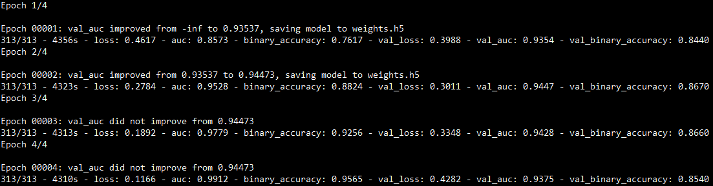
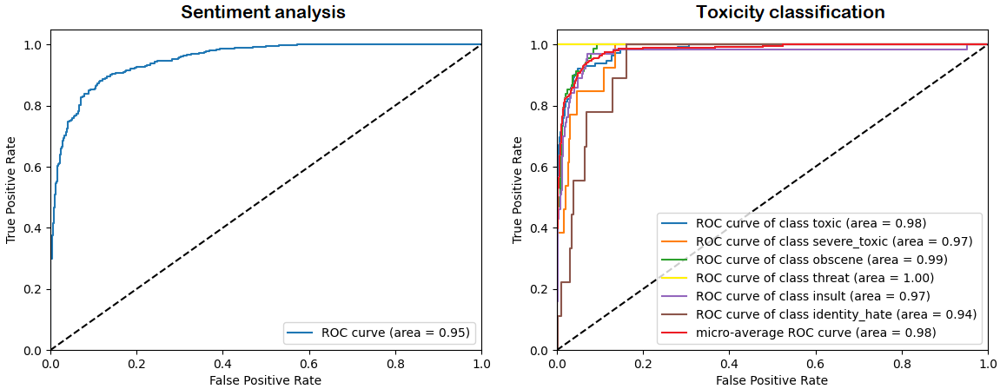

In what follows, I'll show how to fine-tune a BERT classifier using the Huggingface <a href="https://huggingface.co/transformers/quicktour.html">Transformers library</a> and Keras+Tensorflow.

Two different classification problems are addressed:
- <a href="https://www.kaggle.com/lakshmi25npathi/imdb-dataset-of-50k-movie-reviews">IMDB sentiment analysis</a>: detect the sentiment of a movie review, classifying it according to its polarity, i.e. **negative** or **positive**.
- <a href="https://www.kaggle.com/c/jigsaw-toxic-comment-classification-challenge/data">Toxic comment classification</a>: determine the toxicity of a Wikipedia comment, predicting a probability for each type of toxicity, i.e. **toxic**, **severe toxic**, **obscene**, **threat**, **insult** and **identity hate**.

## What is BERT?
**Bidirectional Encoder Representations from Transformers (BERT)** is a Natural Language Processing Model proposed by Google Research in 2018.
It is based on a multi-layer bidirectional Transformer, pre-trained on two unsupervised tasks using a large crossdomain corpus:
- **Masked Language Modeling (MLM)**: 15% of the words in each sequence are replaced with a `[MASK]` token. The model then attempts to predict the masked words, based on the context provided by the non-masked ones.
- **Next Sentence Prediction (NSP)**: the model receives pairs of sentences as input and learns to predict if the second sentence is the subsequent sentence in the original document.

BERT is **deeply bidirectional**, which means that it can learn the context of a word based on all the information contained in the input sequence, joinlty considering previous and subsequent tokens.
In fact, the use of MLM objective enables the representation to fuse the left and right contexts, allowing the pre-training of a deep bidirectional language representation
model.
This is a key difference comparing to previous language representation models like *OpenAI GPT*, which uses a unidirectional (left-to-right) language model, or
*ELMo*, which uses a shallow concatenation of independently trained left-to-right and right-to-left language models.
BERT outperformed many task-specific architectures, advancing the state of the art in a wide range of Natural Language Processing tasks, such as textual entailment,
text classification and question answering.

For further details, you might want to read the original <a href="https://arxiv.org/abs/1810.04805">BERT paper</a>.

## Fine-tuning
Let's now move on how to fine-tune the BERT model in order to deal with our classification tasks. Text classification can be a quite challenging task, but we can easily achieve amazing results by exploiting the effectiveness of transfer learning form pre-trained language representation models.
The first use case is related to the classification of movie reviews according to the expressed sentiment, which can be *positive* or *negative*.
The used data come from the <a href="https://www.kaggle.com/lakshmi25npathi/imdb-dataset-of-50k-movie-reviews">IMDB dataset</a>, which contians 50000 movie reviews equally divided by polarity.
The second case study is about building a model capable of detecting different types of toxicity like threats, obscenity, insults, and identity-based hate. The used <a href="https://www.kaggle.com/c/jigsaw-toxic-comment-classification-challenge/data">dataset</a> is comprised of a large number of comments from Wikipedia. Toxicity detection models are useful for helping online discussion become more productive and respectful.

In the following, I show my Keras code for creating the models.

```python
def create_model(n_out):
    input_ids = layers.Input(shape=(MAX_SEQ_LEN,), dtype=tf.int32, name='input_ids')
    input_type = layers.Input(shape=(MAX_SEQ_LEN,), dtype=tf.int32, name='token_type_ids')
    input_mask = layers.Input(shape=(MAX_SEQ_LEN,), dtype=tf.int32, name='attention_mask')
    inputs = [input_ids, input_type, input_mask]
    bert = TFBertModel.from_pretrained(BERT_NAME)
    bert_outputs = bert(inputs)
    last_hidden_states = bert_outputs.last_hidden_state
    avg = layers.GlobalAveragePooling1D()(last_hidden_states)
    output = layers.Dense(n_out, activation="sigmoid")(avg)
    model = keras.Model(inputs=inputs, outputs=output)
    model.summary()
    return model
```
The only difference between the two models is the number of neurons in the output layer, i.e. the number of independent classes, determined by the `n_out` parameter.
For the first case study, `n_out` is equal to \\(1\\), as we are coping with a binary classification task that involves the calculation of a single sentiment score. This is the probability that the review is positive, 
thus a value close to \\(1\\) indicates a very positive sentence, a value near to \\(0\\) a very negative sentence and a value close to \\(0.5\\) is related to an uncertain situation, or rather a neutral review.
For the second case study, `n_out` is equal to \\(6\\), as we are coping with a multi-label classification with six possible types of toxicity. This means that the model treats each toxicity type as a separate class, computing an independent probability for each one of them through a Bernuolli trial.

As we can see, the BERT model expects three inputs:
- **Input ids**: BERT input sequence unambiguously represents both single text and text pairs. Sentences are encoded using the WordPiece tokenizer, which recursively splits the input tokens until a word in the BERT vocabulary is detected, or the token is reduced to a single char.
 As first token, BERT uses the `CLS` special token, whose embedded representation can be used for classification purposes. Moreover, at the end of each sentence, a `SEP` token is used, which is exploited for differentiating between the two input sentences in the case of text pairs.
- **Input mask**: Allows the model to cleanly differentiate between the content and the padding. The mask has the same shape as the input ids, and contains 1 anywhere the the input ids is not padding.
- **Input types**: Contains 0 or 1 indicating which sentence the token is a part of. For a single-sentence input, it is a vector of zeros.

Huggingface model returns two outputs which can be expoited for dowstream tasks:
- **pooler_output**: it is the output of the BERT pooler, corresponding to the embedded representation of the `CLS` token further processed by a linear layer and a *tanh* activation. It can be used as an aggregate representation of the whole sentence. 
- **last_hidden_state**: 768-dimensional embeddings for each token in the given sentence.

The use of the first output (coming from the pooler) is usually not a good idea, as stated in the Hugginface Transformer documentation:
> This output is usually not a good summary of the semantic content of the input, you’re often better with averaging or pooling the sequence of hidden-states for the whole input sequence.

For this reason I preferred to use a *Global Average Pooling* on the sequence of all hidden states, in order to get a concise representation of the whole sentence. Another thing that usually works is to directly take the embedded representation of the `CLS` token, before it is fed to the BERT pooler.

After the creation of the model, we can fine-tune it as follows:
```python
def fine_tune(model, X_train, x_val, y_train, y_val):
    max_epochs = 4
    batch_size = 32
    opt = tfa.optimizers.RectifiedAdam(learning_rate=3e-5)
    loss = keras.losses.BinaryCrossentropy()
    best_weights_file = "weights.h5"
    m_ckpt = ModelCheckpoint(best_weights_file, monitor='val_auc', mode='max', verbose=2,
                             save_weights_only=True, save_best_only=True)
    model.compile(loss=loss, optimizer=opt, metrics=[keras.metrics.AUC(multi_label=True, curve="ROC"),
                                                     keras.metrics.BinaryAccuracy()])
    model.fit(
        X_train, y_train,
        validation_data=(x_val, y_val),
        epochs=max_epochs,
        batch_size=batch_size,
        callbacks=[m_ckpt],
        verbose=2
    )
```
I trained the model for \\(4\\) epochs using a very low learning rate (\\(3e^{-5}\\)). This last aspect is crucial as we only want to readapt the pre-trained features to work with our downstream task, thus large weight updates are not desirable at this stage. 
Furthermore, we are training a very large model with a relatively small amount of data and a low learning rate is a good choice for minimizing the risk of overfitting.
I used a *binary cross-entropy* loss as the prediction of each of the `n_out` output classes is modeled like a single Bernoulli trial, estimating the probability through a sigmoid activation. Moreover I chose the *Rectified version of ADAM (RAdam)* as the optimizer for the training process. 
**RAdam** is a variant of the Adam optimizer which rectifies the variance and generalization issues apparent in other adaptive learning rate optimizers. The main idea behind this variation is to apply a warm-up with a low initial learning rate, turning also off the momentum term for the first few sets of input training batches.
Lastly, I used the *area under the Receiver operating characteristic curve (ROC AUC)*, and *binary accuracy* as the main metrics for validation and testing.

## Training epochs
In the following, the results of the 4 training epochs of both models are shown:
<p style="text-align: center"><b>Sentiment analysis, IMDB movie reviews</b></p> 

<p style="text-align: center"><b>Toxicity detection, Wikipedia toxic comments</b></p> 


## Results

I evaluated the trained models using \\(1024\\) test samples, achieving the following results:

|  | Test BCE loss | Binary accuracy |     ROC AUC     |
|:-:|:-:|:-:|:-:|
| Sentiment classification | 0.26 | 0.88 | 0.95 |
| Toxicity classification | 0.05 | 0.98 | 0.94 |

As we can see, the easy use of a fine-tuned BERT classifier led us to achieve very promising results, confirming the effectiveness of transfer learning from language representation models pre-trained on a large crossdomain corpus. 
To better analyze the performance of the trained classifiers, *ROC curves* for both models are provided:

We can clearly see the high confidence of both models, especially for what concerns the toxicity classifier which achieved a micro-average ROC AUC of \\(0.98\\).

Just to make it more fun, I wrote some sentences to further test the performance of both models.
<p style="text-align: center"><b>Sentiment analysis, IMDB movie reviews</b></p> 

<p style="text-align: center"><b>Toxicity detection, Wikipedia toxic comments</b></p> 


Good job! :clap::clap: The first model correctly classified the polarity of all movie reviews, even in the presence of sarcasm (look at the last review). 

On the other hand, the second model detected correctly the presence of toxicity in Wikipedia comments or its absence (last comment). It also determined the right types of toxicity, like obscene, toxic and insult for the first and the third comments, or threat for the second one (yes, that's a Liam Neeson quote...I couldn't resist! :laughing:).
<hr>
You can find the full code and results on GitHub at this <a href="https://github.com/rcantini/BERT_text_classification" target="_blank">link</a>.
