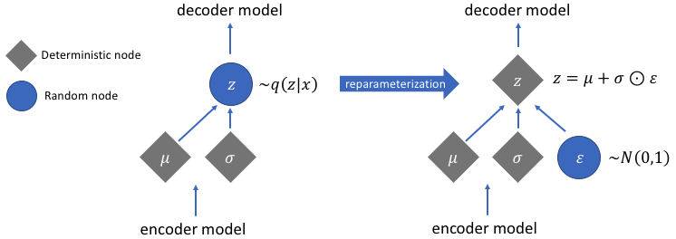

In this post I'll introduce variational autoencoders, showing how they can be applied to the generation of new synthetic images depicting handwritten digits.
I'll describe how to setup and train a CNN-based variational autoencoder using Keras with Tensorflow backend, embedding this generative model within a Flask web application.

## Classical autoencoder
An **autoencoder** is a model that allows to efficiently encode a set of data of interest in an unsupervised manner.
The purpose of this system is to learn a representation of a given input, called encoding, in order to reduce its dimensionality, often high, as in a sort of compression.
In particular, an autoencoder consists of a pair of interconnected neural networks, known as **encoder** and **decoder**, which are often *multilevel perceptrons* (MLPs) or *convolutional neural networks* (CNNs).
The encoder receives an input instance and derives a dense representation in a space with a smaller dimensionality, called *latent space*;
the decoder, afterwards, is able to reconstruct the original input starting from its compressed version.
The training phase involves both networks at the same time, as the encoder learns how to significantly map the input instances in the latent space, while the decoder improves its ability to recompose the output starting from the encoded representation in the space of the latent variables, all aiming to minimize the reconstruction error.
Despite the clear utility of classical autoencoders in tasks like image segmentation, neural inpainting and denoising, they suffer in the context of data generation as the latent space, where the codified vectors lie, is not a continuous space.
This issue hinders the generative power of these systems as well as the possibility of interpolation, as they cannot correctly manage points related to encodings coming from unknown latent space regions, which leads to the reconstruction of an unrealistic output.

## Variational autoencoders
In order to overcome the problems of classic autoencoders, a different class of generative models can be used, the so called **Variational Autoencoders** (VAEs), based on Bayesian inference.
These models aim to model the probability distribution underlying the data, in order to obtain new instances by sampling this distribution.

***Statistical formulation***

The main characteristic of a variational autoencoder, which distinguishes it from a standard autoencoder, is the continuity of the space of its latent variables:
in fact, in such systems any latent attribute is represented in probabilistic terms, using a distribution instead of a discrete value.
Given a certain observation \\( x \\), the VAE tries to infer the characteristics of one or more latent variables \\( z \\) that generate \\( x \\); this is equivalent to compute the conditional probability:

$$
p\left( {z|x} \right) = \frac{{p\left( {x|z} \right)p\left( z \right)}}{{p\left( x \right)}}
$$

The probability expressed in Bayesian terms, is however too hard to compute, since the calculation of the evidence involves a marginalization leading to an intractable distribution:

$$
p\left( x \right) = \int {p\left( {x|z} \right)p\left( z \right)dz}
$$

To overcome this issue, **Variational Inference** can be used, which allows the estimation of this value by approximating the \\( p\left( {z|x} \right) \\) with a tractable one, \\( q\left( {z|x} \right) \\), whose parameters are estimated to make the two distributions as similar as possible.
The dissimilarity between them is measured by the *Kullback-Leibler divergence*.
Starting from this, the loss function for a VAE can be derived and written as follows in terms of minimization:
$$
\min{{\cal L}\left( {x,\hat x} \right) + \sum\limits_j {KL\left( {{q_j}\left( {z|x} \right)||p\left( z \right)} \right)}}
$$

where the first term represents the reconstruction error, while the second estimates how much the learned distribution is similar to the original one, which is assumed to be approximable with a Gaussian of zero mean and unit variance, for each latent space dimension.
Intuitively, this formulation forces the encoder to distribute all the encodings around the origin of the latent space, differentiating them according to the salient characteristics of each type of input, a process that leads to the formation of a clustering structure.
In particular:
- The **reconstruction loss** forces the reconstructed image to be as similar as possible to the original one, getting the VAE to discern the characteristics that distinguish each type of image, a process that induces the formation of a cluster for each type.
- The **KL divergence** works as a regularizer and forces the codings to be sufficiently close to each other, to guarantee the possibility of interpolate encodings lying in different clusters, compacting the clusters within the latent space.

This formulation leads to the generation of instances whose features are the result of a fuzzy combination of latent features of different types, which can be well interpreted by the decoder.

***Structure of a VAE***

A variational autoencoder is made up of a pair of neural networks, an encoder and a decoder, usually realized using a *convolutional neural network* (CNN) or *multilevel perceptron* (MLP).
What differentiates a VAE from a standard autoencoder is the continuity of the generated latent space, which arises from the probabilistic nature of the encoder that doesn’t map the input into an n-dimensional latent point, but provides the parameters to describe the distribution of the input for each dimension of the latent space.
Since this distribution is assumed to be normal, the encoder generates two n-dimensional vectors that correspond to the mean and variance of the Gaussian distribution which maps the input instances into the latent space.
Later, the decoder generates the latent vector by sampling the \\( n \\) distributions individuated by the different *(mean,variance)* pairs, proceeding to the reconstruction of the original input.
This stochastic generation implies that even from the same input, even if mean and variance remain unchanged, the encoding could vary due to the probabilistic nature of sampling. Intuitively, the mean identifies the region of the latent space where the encoding of the input must be located, while the standard deviation expresses the maximum amount of possible variation from this mean.
This approach makes the decoder able to interpret not only the individual latent points, but more generally all those belonging to their spherical neighborhood, within a given standard deviation radius.

Just like traditional autoencoders, encoder and decoder networks are trained simultaneously through gradient descent and the back-propagation algorithm. However, this process is not directly applicable to train a variational autoencoder, due to the probabilistic nature of the latent vector, which leads to the presence of a stochastic node inside the network, through which it’s not possible to back-propagate the error.
To overcome this problem, the so-called **reparameterization trick** is used, which makes deterministic the stochastic node, extrapolating the randomness and transferring it to a variable that doesn’t contribute to the back-propagation process. In particular, instead of maintaining a stochastic node, whose value is obtained through the sampling of a Gaussian distribution \\( N( \mu, \sigma) \\), a new variable \\( \epsilon \\) is introduced, which follows a standard Normal distribution \\( N(0,1) \\). Afterwards, the the value of the latent vector \\(z \\) is obtained by rescaling \\(\epsilon \sim N(0,1) \\) with the value of \\( \mu \\), \\(\sigma \\) computed by the encoder.

The reparameterization trick hence provides a double advantage: on the one hand, it’s possible to optimize the distribution parameters by calculating the gradient with backpropagation, used in a given optimization algorithm, and on the other hand it allows sampling from this distribution. To summarize, the overall structure of the VAE discussed so far can be represented as follows:

## Model implementation: Keras+Tensorflow
Let's now move on how to implement a variational autoencoder based on Convolutional neural networks (CNNs) using Keras framework as model-level library and TensorFlow backend. To read more about CNNs, you can check out my blog post about image classification at this <a href="https://riccardo-cantini.netlify.app/post/dogbreedclass/" target="_blank">link</a>.
 The model is composed of two CNNs: 

- **The encoder** receives in input the gray scale values of the pixels of the image, and to produce in output the two vectors *mean* and *log-variance*, implemented by using two fully connected layers with two neurons each, in order to obtain a two-dimensional latent space. A further Lambda layer with two neurons was stacked on top of the encoder, which implements the reparameterization trick by reconstructing the latent vector starting from mean and log-variance, according to the following formula: \\( z = \mu + e^{\frac{\log\sigma}{2}} \cdot \epsilon \\), where \\( \epsilon \sim N(0,1) \\).

- **The decoder** takes as input the fully connected Lambda layer coming from the encoder’s output, which represents the reparameterized latent vector, and produces in output the reconstructed grey-scale image.

In the following, the overall structure of the implemented convolutional variational autoencoder is shown:

## Model training and 2D-latent space analysis
The model has been trained for 80 epochs, with a batch size of 128 and using the ADAM optimization algorithm, on the well known MNIST dataset of handwitten digits. It consists of a series of \\( 70000 \\) gray-scale images of handwritten digits in \\( 28 \times 28 \\) format, annotated with the represented digit.
Afterwards, some tests were carried out in order to analyze the structure of the latent space and the generative capabilities of the trained model.

***Distribution of the MNIST handwritten digits in the latent space***

The following plot shows the distribution in the latent space of the encodings corresponding to the MNIST digits.

We can clearly see the tendency of the model, provided by the minimization of the reconstruction loss, to cluster the encodings according to the digit they represent, which leads to the formation of \\( 10 \\) clusters. Moreover, these groups are very close to each other, which is due to the minimization of the Kullback-Leibler divergence. This regularizing effect allows interpolation between different classes, as well as the sampling from the latent space for the generation of new images representing handwritten digits.

***Sampling and visualization of the generated digits***

In order to observe more closely the generative capability of the model in terms of continuity and smoothness, the latent space was sampled at regular intervals, visualizing the generated images as the latent coordinates change:

It is easy to observe how the continuity of the latent space allows the generation of realistic digits through random sampling, as well as the smooth interpolation between the various classes of digits. In fact, as you move within the latent space, the depicted digit softly changes, gradually turning into another passing through a series of realistic representations generated by a mix of latent features that the decoder can interpret well.

## Model deployment: Flask+Heroku
Let's finally move on how to develop and deploy a web application that embeds the deep learning model trained above.
In order to build the app I used **Flask**, a framework that enables the rapid creation of web applications. Then I deployed it on **Heroku**, a platform as a service that enables developers to build, run, and operate applications entirely in the cloud.
The structure of our Flask project, will be as follows:
- *CVAE.py* and *app.py*: these files implements the creation and training of the VAE and the Flask-based interaction between the user and the model through the web application.
- *ProcFile*: it is a process file that is required for all Heroku applications. It specifies the commands that are executed by the app on startup.
- *requirements.txt*: it specifies all the dependencies needed by the application.
- *templates* and *static*: these are two folders that contain the html pages and additional global files respectively.

***Let's play with MNIST!***
I embedded the developed web app in this post so that you can try it directly here!

In particular you can use it in two ways:
- Choose a digit (i.e. a number from \\( 0 \\) to \\( 9 \\)) to be drawn by the VAE.
- Explore the 2D latent space by inserting the coordinates of a random point and see which digit is generated.

Have fun! :laughing::laughing:

<iframe src="https://play-with-mnist.herokuapp.com/" width="100%" height="708px"></iframe>

You can find the full code, comprised of the VAE and the Flask application, on GitHub at this <a href="https://github.com/rcantini/CNN-VAE-MNIST" target="_blank">link</a>, while the web application is available <a href="https://play-with-mnist.herokuapp.com/" target="_blank">here</a>.
