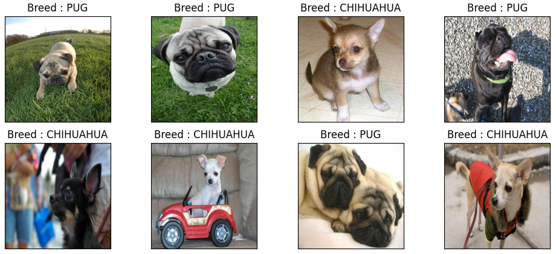

In what follows I'll show how to build a computer vision application with Keras and Tensorflow for classifying dog images according to their breed. The presented model focuses on two particular breeds, **Chihuahua** and **Pug**, and relies on Convolutional Neural Networks, a state-of-art deep learning model for the image classification task.

## Convolutional Neural Networks
**Convolutional neural networks** (*CNNs*) are a deep learning model inspired by the organization and functioning of the animal visual cortex.
Individual neurons are arranged so as to respond to partially overlapping regions that make up the visual field, called *receptive fields*.
These networks, therefore, are very scalable as the complexity of the input increases, thanks to the reduction in the number of parameters and reusability of weights and can learn a meaningful representation of a given image, by automating the feature extraction process.
The classical architecture of a CNN consists of a series of particular layers:
- *Convolutional layer*: given an input image the convolution is carried out using a set of filters, called kernels, which are matrices of learnable weights. Convolution is performed using dot product between the filter and the portion of the image over which it is hovering; the filter is shifted according to a stride parameter and this process is repeated until the the entire imagehas been covered, generating an output volume composed by a set of convolved feature maps.
The convolution of a \\(3\times 3\\) kernel applied to a single-channel \\(5\times 5\\) image is showed below:

- *Relu layer*: Rectified Linear Unit is the typical activation function of convolutional levels, defined as \\(f(x) = max(0, x)\\). It is designed to preserve non-linearity properties, without causing distortion effects on the receptive fileds.
This function has many interesting properties, including efficiency, robustness against weight saturation or vanishing gradient, as well as the sparse activation of artificial neurons, which mimics what happens in biological systems, where only few neurons activate simultaneously.
- *Pooling layer*: the role of this layer is to reduce the spatial size of the output volume from the convolutional layer, extracting rotational and positional invariant features. Dimensionality reduction is carried out using a kernel which moves upon the input matrices, taking the maximum (or the average) of the covered values.
- *Fully-connected layer*: the output of convolutional and pooling layers can be flattened and feed to a dense layer of fully connected neurons, in order to learn a non-linear combination of the learned features. Finally a softmax classifier can be used for determining a probability value for each class label.

# Dog breed classifier: Chihuahua vs. Pug
Let's now move on how to use Convolutional Neural Networks in Keras in order to build our breed classifier, for distinguish a Chihuahua from a Pug. Our dataset is an extract from <a href="https://www.w3schools.com/">Dog Breed Identification</a>, and is composed by 152 Chihuahua and 200 Pug images.
Now let's look at some example images from our dataset:

This is a really challenging classification task, as the pattern to be learned are quite complex and the training images are few compared to how many a CNN would need to learn meaningful features. In order to cope with the small amount of traning data, the model exploits three main techniques:
- Real time data augmentation during training
- Transfer Learning
- Fine tuning

Link all'articolo originale: <a href="https://www.unical.it/portale/portaltemplates/view/view.cfm?100297&fbclid=IwAR1WC13GLzbYeVz3B4Cem93M6xjtfM-10VTEYm3tvYeiAYZieEQbKkd2qQ0" target="_blank">Portale UNICAL - Notizie</a>

Link alla pubblicazione: <a href="https://ieeexplore.ieee.org/document/9026882" target="_blank">Learning political polarization on social media using neural networks</a>
