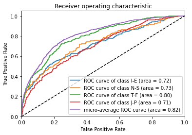
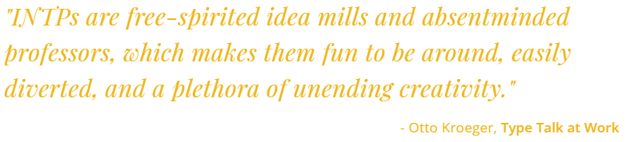

In what follows I'll show how to fine-tune a **BERT** classifier using the *Huggingface Transformers* library and *Keras+Tensorflow* in order to understand users' personality based on some text they have posted.
In particular, the personality of a user is modeled starting from his/her writing style according the **Myers–Briggs Type Indicator (MBTI)**, which distinguishes between 16 distinct personality types across 4 axis:
- Introversion (I) <--> Extroversion (E)
- Intuition (N) <--> Sensing (S)
- Thinking (T) <--> Feeling (F)
- Judging (J) <--> Perceiving (P)

The notebook, described in the following, was developed on *Google Colab* and is comprised of the following steps:
- **Data preparation**: MBTI data are loaded, preprocessed and prepared according to the BERT specifications.
- **Fine tuning of the BERT classifier**: a classification layer is stacked on top of the BERT encoder and the entire model is fine-tuned, fully exploiting the GPU support provided by Google Colab, with very low training times.
- **Performance evaluation**: I evaluated the trained model using *ROC AUC* and *Accuracy* metrics, achieving an AUC of *0.73* and a binary accuracy of *0.75* on the test set.
<div class="cell markdown" id="6NELeva1mgKY">

## Set the environment

</div>

<div class="cell markdown" id="J9fxLAysiv-r">

***Import necessary libraries***

</div>

<div class="cell code" id="hHd2FsCr_3_Q">

``` python
import pandas as pd
from transformers import TFBertModel, BertTokenizer
seed_value = 29
import os
os.environ['PYTHONHASHSEED'] = str(seed_value)
import random
random.seed(seed_value)
import numpy as np
np.random.seed(seed_value)
np.set_printoptions(precision=2)
import tensorflow as tf
tf.random.set_seed(seed_value)
import tensorflow_addons as tfa
import tensorflow.keras as keras
import tensorflow.keras.layers as layers
from tensorflow.keras.callbacks import ModelCheckpoint
import re
import matplotlib.pyplot as plt
from sklearn.metrics import auc, roc_curve
```

</div>

<div class="cell markdown" id="c0VpikUNIkcY">

***Enable GPU processing***
</div>

<div class="cell code" data-execution_count="4" data-colab="{&quot;base_uri&quot;:&quot;https://localhost:8080/&quot;}" id="w8JboDdFJprS" data-outputId="ad6eebfe-3d0f-4224-9396-50730460b409">

``` python
device_name = tf.test.gpu_device_name()
if device_name != '/device:GPU:0':
  raise SystemError('GPU device not found')
print('Found GPU at: {}'.format(device_name))
```

<div class="output stream stdout">

    Found GPU at: /device:GPU:0

</div>

</div>


<div class="cell markdown" id="eFirQBWwaDiU">

## Model training

I modeled personality detection on the <a href="https://www.kaggle.com/datasnaek/mbti-type">MBTI dataset</a> as a multilabel
classification task.

In particular, the model treats each personality axis as a separate
class, computing an independent probability for each one of them through
a Bernuolli trial.

The model is based on **BERT** and exploits
the effectiveness of transfer learning form pre-trained language
representation models.

</div>

<div class="cell code" id="iB0anvSEDa-Q">

``` python
N_AXIS = 4
MAX_SEQ_LEN = 128
BERT_NAME = 'bert-base-uncased'
'''
EMOTIONAL AXES:
Introversion (I) – Extroversion (E)
Intuition (N) – Sensing (S)
Thinking (T) – Feeling (F)
Judging (J) – Perceiving (P)
'''
axes = ["I-E","N-S","T-F","J-P"]
classes = {"I":0, "E":1, # axis 1
           "N":0,"S":1, # axis 2
           "T":0, "F":1, # axis 3
           "J":0,"P":1} # axis 4
```

</div>

<div class="cell markdown" id="kOCrp6AEj6ud">

***Preprocessing***

The following operations are performed: text lowercasing, removing text
in square brackets, links, words containing numbers, emoji and initial
single quotes.

</div>

<div class="cell code" id="99U8SFjMD-di">

``` python
def text_preprocessing(text):
    text = text.lower()
    text = re.sub('\[.*?\]', '', text)
    text = re.sub('https?://\S+|www\.\S+', '', text)
    text = re.sub('<.*?>+', '', text)
    text = re.sub('\n', '', text)
    text = re.sub('\w*\d\w*', '', text)
    text.encode('ascii', 'ignore').decode('ascii')
    if text.startswith("'"):
        text = text[1:-1]
    return text
```

</div>

<div class="cell markdown" id="S3IidzgPkirL">

MBTI dataset is loaded and partitioned into train, val and test set; the last
incomplete batch is skipped.

</div>

<div class="cell code" data-colab="{&quot;base_uri&quot;:&quot;https://localhost:8080/&quot;}" id="0X2l712HDfes" data-outputId="8d9974b1-7ee0-4b50-d446-d57c23547df7">

``` python
train_n=6624
val_n=1024
test_n=1024
data = pd.read_csv("mbti_1.csv")
data = data.sample(frac=1)
labels = []
print(data)
for personality in data["type"]:
    pers_vect = []
    for p in personality:
        pers_vect.append(classes[p])
    labels.append(pers_vect)
sentences = data["posts"].apply(str).apply(lambda x: text_preprocessing(x))
labels = np.array(labels, dtype="float32")
train_sentences = sentences[:train_n]
y_train = labels[:train_n]
val_sentences = sentences[train_n:train_n+val_n]
y_val = labels[train_n:train_n+val_n]
test_sentences = sentences[train_n+val_n:train_n+val_n+test_n]
y_test = labels[train_n+val_n:train_n+val_n+test_n]
```

<div class="output stream stdout">

``` 
      type                                              posts
4420  INFP  i guess he's just preparing for wwIII, which w...
7570  ENTJ  'More like whenever we start talking about any...
2807  INFP  'I have this really strange fear of shiny jewe...
463   ISTP  'Exactly!   :cheers2:|||Same here! So curious....
3060  INFJ  'May I pop in?  I've been struggling with perf...
...    ...                                                ...
920   INFP  'Those are excellent examples and explanation,...
864   INTP  'I was thinking the same.|||we do that sometim...
808   ISTP  'Associate in Professional Flight Technology||...
6380  INFJ  'I just love this...  https://www.youtube.com/...
8149  INTJ  'I haven't posted here in a while.  Forgive me...

[8675 rows x 2 columns]
```

</div>

</div>

<div class="cell markdown" id="B5chRz0LlErU">

Sentences are encoded following the BERT specifications.

</div>

<div class="cell code" id="X5Y63zfXEZdp">

``` python
def prepare_bert_input(sentences, seq_len, bert_name):
    tokenizer = BertTokenizer.from_pretrained(bert_name)
    encodings = tokenizer(sentences.tolist(), truncation=True, padding='max_length',
                                max_length=seq_len)
    input = [np.array(encodings["input_ids"]), np.array(encodings["token_type_ids"]),
               np.array(encodings["attention_mask"])]
    return input
```

</div>

<div class="cell code" data-colab="{&quot;height&quot;:66,&quot;base_uri&quot;:&quot;https://localhost:8080/&quot;,&quot;referenced_widgets&quot;:[&quot;89b6f158b4654be2b65f50b05ab71a3e&quot;,&quot;030751c6afd44ba7a4d75b54495bed26&quot;,&quot;82e19cc484064475a1ac8aa6f9db4dd2&quot;,&quot;cdc9103f23ce4e0e82e99b1b34b34206&quot;,&quot;db6561beb818435bb5e49c322fd01cad&quot;,&quot;1cf1c7d6095b40c98a19d9524211990b&quot;,&quot;edb500e5c9a8482aa8b4687bcea15be7&quot;,&quot;cefb289949c24dd7b0b7dac218cbe96d&quot;]}" id="gbDSJnVDG2MQ" data-outputId="f3c9fb90-03cc-424a-9153-0ddf29f19d45">

``` python
X_train = prepare_bert_input(train_sentences, MAX_SEQ_LEN, BERT_NAME)
X_val = prepare_bert_input(val_sentences, MAX_SEQ_LEN, BERT_NAME)
X_test = prepare_bert_input(test_sentences, MAX_SEQ_LEN, BERT_NAME)
```

</div>

<div class="cell markdown" id="w07z0dynn3_Z">

***Model architecture***

Encoded input is processed by the BERT model. Then, a Global Average
Pooling on the sequence of all hidden states is used in order to get a
concise representation of the whole sentence. Finally the output sigmoid
layer compute an independent probability for each personality axis.

</div>

<div class="cell code" data-colab="{&quot;height&quot;:866,&quot;base_uri&quot;:&quot;https://localhost:8080/&quot;,&quot;referenced_widgets&quot;:[&quot;32a98acce1724dfcac48ccabba5fb437&quot;,&quot;649e5a239dcd48129c60915309248433&quot;,&quot;dd3b76d619534ead9383d424063e95c8&quot;,&quot;4cbcb95abf9046d8aea17a882c928626&quot;,&quot;1c1d1d03d7104b6faac2bc674202be30&quot;,&quot;36deab58d5b64e31a1b9b60d5c19ffb4&quot;,&quot;0c4abcc8366f4a8eb6b82d351d2429a6&quot;,&quot;7e55bda9c3374c1994f7428e79cbf683&quot;,&quot;127cfb1aebf448f689860f3762ffefd1&quot;,&quot;384d78d33ef249e8be2b0df5bbe4e635&quot;,&quot;9ba0e5b31c8c4148ba1460a5ea8ccbc2&quot;,&quot;7226dda2400849c7bf8ab586cc8848b1&quot;,&quot;09fae8b6729a4e52817b8e27c0793c42&quot;,&quot;ed75fd8d6a2a4427bbc2596993efa3d3&quot;,&quot;6e5274b5f81040549a38acf5d1e53c91&quot;,&quot;95e555bd66504d8e941f52f97672740d&quot;]}" id="0v4H0aixJPaD" data-outputId="a0afe1ad-b13d-4bf7-a822-977b173a4bc0">

``` python
input_ids = layers.Input(shape=(MAX_SEQ_LEN,), dtype=tf.int32, name='input_ids')
input_type = layers.Input(shape=(MAX_SEQ_LEN,), dtype=tf.int32, name='token_type_ids')
input_mask = layers.Input(shape=(MAX_SEQ_LEN,), dtype=tf.int32, name='attention_mask')
inputs = [input_ids, input_type, input_mask]
bert = TFBertModel.from_pretrained(BERT_NAME)
bert_outputs = bert(inputs)
last_hidden_states = bert_outputs.last_hidden_state
avg = layers.GlobalAveragePooling1D()(last_hidden_states)
output = layers.Dense(N_AXIS, activation="sigmoid")(avg)
model = keras.Model(inputs=inputs, outputs=output)
model.summary()
```

<div class="output stream stdout">

    Model: "model"
    __________________________________________________________________________________________________
    Layer (type)                    Output Shape         Param #     Connected to                     
    ==================================================================================================
    input_ids (InputLayer)          [(None, 128)]        0                                            
    __________________________________________________________________________________________________
    token_type_ids (InputLayer)     [(None, 128)]        0                                            
    __________________________________________________________________________________________________
    attention_mask (InputLayer)     [(None, 128)]        0                                            
    __________________________________________________________________________________________________
    tf_bert_model (TFBertModel)     TFBaseModelOutputWit 109482240   input_ids[0][0]                  
                                                                     token_type_ids[0][0]             
                                                                     attention_mask[0][0]             
    __________________________________________________________________________________________________
    global_average_pooling1d (Globa (None, 768)          0           tf_bert_model[0][0]              
    __________________________________________________________________________________________________
    dense (Dense)                   (None, 4)            3076        global_average_pooling1d[0][0]   
    ==================================================================================================
    Total params: 109,485,316
    Trainable params: 109,485,316
    Non-trainable params: 0
    __________________________________________________________________________________________________

</div>

</div>

<div class="cell markdown" id="WtksP0CQoSd-">

***End-to-end fine-tuning***

The model is fully fine-tuned with a small learning rate in order to
readapt the pre-trained features to work with our downstream task. I
used a binary cross-entropy loss as the prediction for each personality
axis is modeled like a single Bernoulli trial, estimating the
probability through a sigmoid activation. Moreover I chose the Rectified
version of ADAM (RAdam) as the optimizer for the training process.
Lastly, I used the area under the Receiver Operating Characteristic
curve (ROC AUC), and binary accuracy as the main metrics for validation
and testing.

</div>

<div class="cell code" data-colab="{&quot;base_uri&quot;:&quot;https://localhost:8080/&quot;}" id="02oKXsn4Jtlq" data-outputId="b7a1e628-04b0-4e2f-9306-6820475ee213">

``` python
max_epochs = 7
batch_size = 32
opt = tfa.optimizers.RectifiedAdam(learning_rate=3e-5)
loss = keras.losses.BinaryCrossentropy()
best_weights_file = "weights.h5"
auc = keras.metrics.AUC(multi_label=True, curve="ROC")
m_ckpt = ModelCheckpoint(best_weights_file, monitor='val_'+auc.name, mode='max', verbose=2,
                          save_weights_only=True, save_best_only=True)
model.compile(loss=loss, optimizer=opt, metrics=[auc, keras.metrics.BinaryAccuracy()])
model.fit(
    X_train, y_train,
    validation_data=(X_val, y_val),
    epochs=max_epochs,
    batch_size=batch_size,
    callbacks=[m_ckpt],
    verbose=2
)
```

<div class="output stream stdout">

    Epoch 1/7
    207/207 - 226s - loss: 0.5899 - auc: 0.5325 - binary_accuracy: 0.6766 - val_loss: 0.5608 - val_auc: 0.6397 - val_binary_accuracy: 0.7034
    
    Epoch 00001: val_auc improved from -inf to 0.63968, saving model to weights.h5
    Epoch 2/7
    207/207 - 192s - loss: 0.5275 - auc: 0.6807 - binary_accuracy: 0.7446 - val_loss: 0.5115 - val_auc: 0.7260 - val_binary_accuracy: 0.7551
    
    Epoch 00002: val_auc improved from 0.63968 to 0.72596, saving model to weights.h5
    Epoch 3/7
    207/207 - 192s - loss: 0.4856 - auc: 0.7569 - binary_accuracy: 0.7662 - val_loss: 0.4999 - val_auc: 0.7492 - val_binary_accuracy: 0.7607
    
    Epoch 00003: val_auc improved from 0.72596 to 0.74920, saving model to weights.h5
    Epoch 4/7
    207/207 - 192s - loss: 0.4354 - auc: 0.8146 - binary_accuracy: 0.7960 - val_loss: 0.5079 - val_auc: 0.7448 - val_binary_accuracy: 0.7559
    
    Epoch 00004: val_auc did not improve from 0.74920
    Epoch 5/7
    207/207 - 192s - loss: 0.3572 - auc: 0.8827 - binary_accuracy: 0.8405 - val_loss: 0.5638 - val_auc: 0.7336 - val_binary_accuracy: 0.7441
    
    Epoch 00005: val_auc did not improve from 0.74920
    Epoch 6/7
    207/207 - 192s - loss: 0.2476 - auc: 0.9467 - binary_accuracy: 0.8962 - val_loss: 0.7034 - val_auc: 0.7294 - val_binary_accuracy: 0.7490
    
    Epoch 00006: val_auc did not improve from 0.74920
    Epoch 7/7
    207/207 - 192s - loss: 0.1442 - auc: 0.9825 - binary_accuracy: 0.9436 - val_loss: 0.8970 - val_auc: 0.7172 - val_binary_accuracy: 0.7407
    
    Epoch 00007: val_auc did not improve from 0.74920

</div>

</div>

<div class="cell markdown" id="K63gLa1IqMEG">

## Results evaluation

</div>

<div class="cell markdown" id="YKx_ayhiqh4U">

Evaluate the model on the test set.

</div>

<div class="cell code" data-colab="{&quot;base_uri&quot;:&quot;https://localhost:8080/&quot;}" id="ZxMVRgmtMw_B" data-outputId="fce1b383-89ff-4cb9-e84a-08fe02b9d800">

``` python
loss = keras.losses.BinaryCrossentropy()
best_weights_file = "weights.h5"
model.load_weights(best_weights_file)
opt = tfa.optimizers.RectifiedAdam(learning_rate=3e-5)
model.compile(loss=loss, optimizer=opt, metrics=[keras.metrics.AUC(multi_label=True, curve="ROC"),
                                                  keras.metrics.BinaryAccuracy()])
predictions = model.predict(X_test)
model.evaluate(X_test, y_test, batch_size=32)
```

<div class="output stream stdout">

    32/32 [==============================] - 11s 274ms/step - loss: 0.5174 - auc_2: 0.7249 - binary_accuracy: 0.7500

</div>

</div>

<div class="cell markdown" id="zKQjmtE0qgUS">

Plot ROC AUC for each personality axis.

</div>

<div class="cell code" id="GEqlxpz0MlQO">

``` python
def plot_roc_auc(y_test, y_score, classes):
    assert len(classes) > 1, "len classes must be > 1"
    plt.figure()
    if len(classes) > 2:  # multi-label
        # Compute ROC curve and ROC area for each class
        for i in range(len(classes)):
            fpr, tpr, _ = roc_curve(y_test[:, i], y_score[:, i])
            roc_auc = auc(fpr, tpr)
            plt.plot(fpr, tpr, label='ROC curve of class {0} (area = {1:0.2f})'.format(classes[i], roc_auc))
        # Compute micro-average ROC curve and ROC area
        fpr, tpr, _ = roc_curve(y_test.ravel(), y_score.ravel())
        roc_auc = auc(fpr, tpr)
        # Plot ROC curve
        plt.plot(fpr, tpr, label='micro-average ROC curve (area = {0:0.2f})'.format(roc_auc))
    else:
        fpr, tpr, _ = roc_curve(y_test, y_score)
        roc_auc = auc(fpr, tpr)
        plt.plot(fpr, tpr, label='ROC curve (area = {0:0.2f})'.format(roc_auc))
    plt.plot([0, 1], [0, 1], 'k--')
    plt.xlim([0.0, 1.0])
    plt.ylim([0.0, 1.05])
    plt.xlabel('False Positive Rate')
    plt.ylabel('True Positive Rate')
    plt.title('Receiver operating characteristic')
    plt.legend(loc="lower right")
    plt.show()
```

</div>

<div class="cell code" data-colab="{&quot;height&quot;:295,&quot;base_uri&quot;:&quot;https://localhost:8080/&quot;}" id="2ERfcy_2qdle" data-outputId="4a7761ca-cff4-4dde-d18b-7722502ded1d">

``` python
plot_roc_auc(y_test, predictions, axes)
```


</div>

<div class="cell markdown" id="W3vxfXH4qtYt">

As a final step, I tested the model by writing a simple sentence in order to find out my personality.

</div>

<div class="cell code" data-colab="{&quot;base_uri&quot;:&quot;https://localhost:8080/&quot;}" id="-tLGVE4AMy5F" data-outputId="38fa5cc3-c95a-470e-905e-bc55eef3485e">

``` python
s1 = "I like studying deep learning, playing football and my guitar, " \
     "and I love visit foreign cities all over the world."
sentences = np.asarray([s1])
enc_sentences = prepare_bert_input(sentences, MAX_SEQ_LEN, BERT_NAME)
predictions = model.predict(enc_sentences)
for sentence, pred in zip(sentences, predictions):
    pred_axis = []
    mask = (pred > 0.5).astype(bool)
    for i in range(len(mask)):
        if mask[i]:
            pred_axis.append(axes[i][2])
        else:
            pred_axis.append(axes[i][0])
    print('-- comment: '+sentence.replace("\n", "").strip() +
          '\n-- personality: '+str(pred_axis) +
          '\n-- scores:'+str(pred))
```

<div class="output stream stdout">

    -- comment: I like studying deep learning, playing football and my guitar, and I love visit foreign cities all over the world.
    -- personality: ['I', 'N', 'T', 'P']
    -- scores:[0.18 0.44 0.36 0.79]

</div>

***Who is an INTP?*** :thinking:
- **I**: Introversion dominant over extroversion: INTPs tend to be quiet and reserved. They generally prefer to interact with a few close friends instead of a large circle of acquaintances.
- **N**: Intuition dominant over sensation: INTPs tend to be more abstract than concrete. They focus their attention on the big picture of things rather than on the details, and they value future possibilities more than immediate reality.
- **T**: Rational thinking dominant over sentiment: INTPs tend to give greater value to objective criteria than personal or sentimental preferences. In making a decision, they place more emphasis on logic than on social considerations.
- **P**: Perception dominant over judgment: INTPs tend to be reluctant to make decisions too quickly, preferring to leave options open and analyze all possibilities before deciding.



</div>
<hr>
You can find the full code and results on GitHub at this <a href="https://github.com/rcantini/BERT_personality_detection" target="_blank">link</a>.
