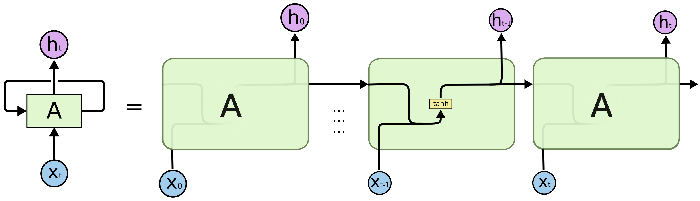
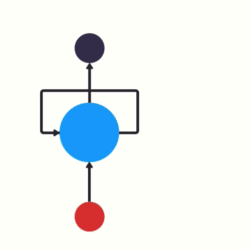
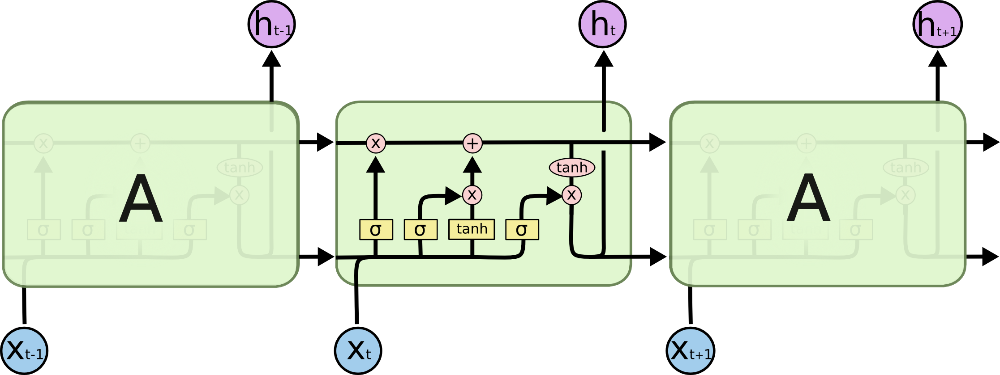
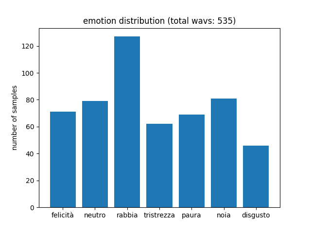
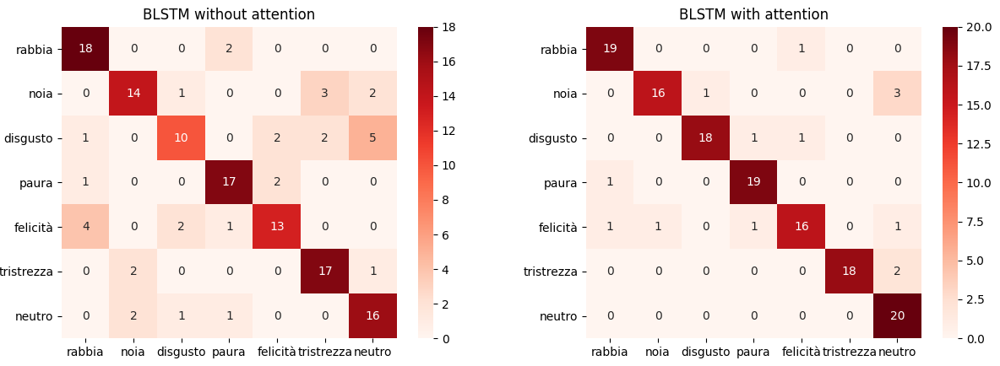
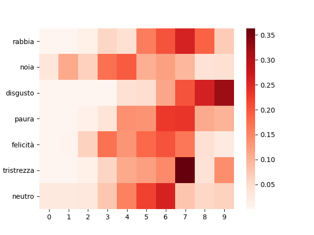

This post is dedicated to the development of an artificial intelligence application capable of identifying the emotions expressed through the voice in spoken language.
The classification system focuses on seven different emotions (*anger*, *boredom*, *disgust*, *fear*, *happiness*, *sadness*, *neutral*) and exploits an attention-based Long Short-Term Memory (LSTM) neural network, a state-of-art deep learning model for the analysis of sequential data, widely used in the field of Natural Language Processing (NLP).

## Long Short-Term Memory Networks
The main idea behind this kind of deep learning model is simple but powerful and is inspired by the way reasoning occurs in the human brain. In particular, humans don't start thinking from scratch every time, but they use memory in order to interpret better a given information, contextualizing it based on past information.
This kind of persistency, which is absent in traditional feed-forward neural networks, is realized by **Recurrent Neural Networks** (RNN).
These networks are able to use past information thanks to their loop structure, which can be better represented by unrolling the network through time.

Persistency of information is achieved passing the current *hidden state* to the next step of the sequence. So, at each time step, the hidden state carries information about what the neural network has seen so far, acting like a memory element.
At the time \\(t\\), the hidden state \\(h_t\\) is computed as the concatenation of the previous hidden state \\(h_{t-1}\\) and the current element of the input sequence \\(x_t\\), which undergoes a non-linear transformation through the tanh activation.


The problem of this kind of networks is that information cannot be carried effectively if the time sequence is too long, which means that we could lose important connections if the distance between useful information and the instant in which it is needed is very large.
For dealing with long short-term dependencies, **Long Short-Term Memory** networks (LSTM) have been proposed, whose architecture is shown below.

The key element in LSTM networks is the *cell state*, which acts like memory element, undergoing only a few transformations along the entire chain. In particular, the flow of information is regulated by three structures called gates.
- *Forget gate*: determines to what extent the components of the cell state must be maintained, by calculating a score using the sigmoid function.
$$
f_{t}= \sigma (W_f \cdot [h_{t-1}, x_t] + b_f)
$$
- *Input gate*: determines what new information to store in the cell state. In particular, a sigmoid layer chooses which state values ​​should be updated, while a tanh layer determines the new candidate values.
$$
i_{t}= \sigma (W_i \cdot [h_{t-1}, x_t] + b_i)
$$

$$
\tilde{C}_t= x
$$

At this time the cell state can be updated as: \\(C_t =f_t\times C_{t-1}+i_t \times \tilde{C}_t\\)
- *Output gate*: determines the final output of the module as a filtered version of the updated cell state:
$$
o_{t}= \sigma (W_o \cdot [h_{t-1}, x_t] + b_o)
$$
$$
h_t = o_t\times tanh(C_t)
$$

## Emotion detection
Let's now move on how to use LSTM Neural Networks in Keras, in order to build our emotion detection application. Our dataset is the <a href="https://www.kaggle.com/piyushagni5/berlin-database-of-emotional-speech-emodb">Berlin Dataset of Emotional Speech (EMO-DB)</a>.
For its construction 10 actors have been used, who were asked to read 10 portions of different text, simulating seven different emotions: **anger**, **boredom**, **disgust**, **anxiety**, **fear**,
**happiness**, **sadness** and a **neutral** version, which does not belong to any emotional state. The recordings were made at a frequency of 48kHz, subsampled to 16kHz, inside anechoic chambers provided by the *Department of Technical Acoustics of Berlin University*, 
which are designed to minimize the distorting effect of noise.
Classifying these recordings according to the expressed emotion is a quite challenging task, as the input data must be represented in an effective way and the patterns to be learned are quite complex.

## Feature extraction
Features have been extracted from wav format audio files by exploiting **Librosa**, a Python package for music and audio analysis. In particular, I used the following \\(46\\) features:
- *Spectral centroid*: indicates where the centre of mass for a sound is located and is calculated as the weighted mean of the sound frequencies.
- *Spectral contrast*: estimates the energy contrast by comparing the peak energy to the valley energy.
- *Spectral bandwidth*: is the wavelength interval in which a spectral quantity is not less than half its maximum value.
- *Spectral rolloff*: represents the frequency below which a specified percentage of the total spectral energy lies.
- *Zero crossing rate*: is the rate at which the signal changes from positive to negative or back.
- *Root Mean Square*: describes the average signal amplitude.
- *Mel frequency cepstral coefficients (MFCCs)*: a small set of features (20 coefficients) which model the characteristics of the human voice, concisely describing the overall shape of the spectral envelope.
- *MFCC's first order derivatives*: 20 coefficients which capture the ways in which the MFCCs of the audio signal vary over time.


I used a frame length \\(l=512\\) and imposed a maximum duration of \\(d=5\\) seconds. So, as we have a frequency \\(f\\) of 16kHz for audio signals, we will have a number of frames: \\(N = ceil(f\times d/l) = 157\\).
Computing the above 46 features for each of the 157 frames and each of the 535 audio files, we will end up with a 3D input dataset with shape \\(535\times 157\times 46\\), which is very suitable to be analyzed with an LSTM model.
In fact, we can look at each file in our dataset as a time sequence of 157 frames, each one containing its descriptive features.

## Class balancing
The dataset is composed by 535 audio files, whose emotion distribution is shown below.

As we can see, training samples are quite unbalanced, which can cause problems in recognizing less represented emotions, such as disgust or sadness.
To cope with this issue, I used a class balancing strategy called **Synthetic Minority Over-sampling Technique** (SMOTE). It is an oversampling technique, which consists in increasing the number of samples relating to the less represented classes.
In particular, new synthetic examples are created through interpolation techniques in order to obtain the same number of samples per class. After class balancing, the dataset contains 749 examples, from which 20 non-synthetic samples per class are selected as our test set.
It is crucial here to select non-synthetic test samples for measuring fairly the performance of our classification model.


## Attention mechanism for emotion detection 
The use of **attention mechanism** in neural networks have demonstrated great success in a wide range of tasks, such as question answering, machine translations, natural language understanding and speech recognition.
The main idea behind the attention mechanism, which mimics human behaviour, is to selectively concentrate on a few relevant things, while ignoring the rest. 
There are many variations of this mechanism (*global* vs. *local*, *soft* vs. *hard*) but its main use, for enhancing LSTM models such as encoder-decoder structures (e.g. in machine translation), is to avoid the use of a **fixed context vector** as the only output of the encoder. Specifically, it is the last hidden state of the LSTM, which carries all the information extracted by the LSTM encoder. 
So, in the classical structure, all the information is compressed into the context vector, which can act as a bottleneck, while all the intermediate hidden states of the encoder are ignored. This vector is then fed to the subsequent layers, such as *LSTM decoder* or *Dense*. 
As for the subsequent steps we only depend on this kind of summarization given by the encoder, the performances can degrade as the length of the analyzed temporal sequence increases: to cope with this problem, attention mechanism is the way!

In general, according to this mechanism, every encoder hidden state, generated while processing the input sequence, is taken into account, calculating for each one of them an attention score (**energy** \\(e\\)) using an **alignment function** \\(a\\). By normalizing these scores with a softmax function, we obtain the **attention weights** (\\(\alpha\\)), which
determine the amount of attention we should pay to each hidden state in order to generate the desired output. For example, in encoder-decoder translation architectures, the attention weight \\(\alpha_{t,t'}\\) gives us a measure of the attention we should pay to the word at position \\(t'\\) while predicting the \\(t\\)-th word.
Given the attention weights for the \\(t \\)-th word, we can compute the <b>dynamic context vector</b> \\(c_t\\) as the weighted sum of the encoder hidden states: \\(c_t =\sum_{i=1}^{n}\alpha_{t,i}h_i\\). So the crucial part of the entire mechanism is to determine the attention scores, and the main implementations present today vary according to the specific alignment function they use:
- **Additive** or **concat** (*Bahdanau*): \\(e_{i,j}=v_a^Ttanh(W_as_{i-1}+U_ah_j)\\), where \\(s_{i-1}\\) is the previous decoder hidden state, \\(h_j\\) is the \\(j\\)-th encoder hidden state and \\(W_a\\), \\(U_a\\) and \\(v_a\\) are trainable matrices. We can look at the alignment model \\(a\\) as a feedforward neural network with one hidden layer.
- **Dot-product** (*Luong*): \\(e_{i,j}=s_i^T h_j\\). This model is easier than additive attention and involves no weights to train. Furthermore, the dot product can be scaled in order to improve performances, avoiding small gradients, obtaining the so-called <b>scaled dot-product attention</b>.
- Other types of attention are **location-based**, **general** and **content-based**.

For our emotion detection model I used a **Bahdanau-style global soft attention**. In particular, I adapted the formula to this classification task, where the decoder is absent. The alignment model is, like in Bahdanau, a parametrized feedforward neural network and the energies are computed as \\(e_{j}=v_a^Ttanh(U_ah_j)\\). A scaling operation is then performed for improving weights learnability. 
The context vector is then computed as the weighted sum of the encoder hidden states with the normalized energies (<i>attention weights</i>) and then concatenated to the last
encoder hidden state to improve performances. Finally, a softmax classifier is used for determining a probability distribution for the expressed emotions.

In the following, I show the Keras implementation of the proposed model (*Attention_BLSTM*). In order to assess the benefits brought by the attention mechanism, a simplified version of the model without attention (*BLSTM*) is also provided.
```python
def create_model(units=256):
    input = keras.Input(shape=(pre_proc.N_FRAMES, pre_proc.N_FEATURES))
    if MODEL == "Attention_BLSTM":
        states, forward_h, _, backward_h, _ = layers.Bidirectional(
            layers.LSTM(units, return_sequences=True, return_state=True)
        )(input)
        last_state = layers.Concatenate()([forward_h, backward_h])
        hidden = layers.Dense(units, activation="tanh", use_bias=False,
                              kernel_initializer=keras.initializers.RandomNormal(mean=0., stddev=1.)
                              )(states)
        out = layers.Dense(1, activation='linear', use_bias=False,
                              kernel_initializer=keras.initializers.RandomNormal(mean=0., stddev=1.)
                              )(hidden)
        flat = layers.Flatten()(out)
        energy = layers.Lambda(lambda x:x/np.sqrt(units))(flat)
        normalize = layers.Softmax()
        normalize._init_set_name("alpha") ###for visualizing attention, more on this later...
        alpha = normalize(energy)
        ctx = layers.Dot(axes=1)([states, alpha])
        context_vector = layers.Concatenate()([ctx, last_state])
    elif MODEL == "BLSTM":
        context_vector = layers.Bidirectional(layers.LSTM(units, return_sequences=False))(input)
    else:
        raise Exception("Unknown model architecture!")
    pred = layers.Dense(pre_proc.N_EMOTIONS, activation="softmax")(context_vector)
    model = keras.Model(inputs=[input], outputs=[pred])
    model._init_set_name(MODEL)
    print(str(model.summary()))
    return model
```

## Results

I evaluated the trained models using 20 test samples per emotion. The attention-based BLSTM achieved a 90% accuracy, while its simplified version which does not use attention achieved about 75% accuracy.

|  | Accuracy | Precision | Recall | F1-Score |
|-|-|-|-|-|
| BLSTM | 0.75 | 0.75 | 0.75 | 0.74 |
| Attention-based BLSTM | 0.90 | 0.91 | 0.90 | 0.90 |

As we can easily see, the use of the attention mechanism has led to much higher performances than a classical BSLTM. To better see the performance improvement in recognizing the different emotions, confusion matrices for both models are provided:

We can clearly see a good improvement in recognizing every emotion, most of all for what concerns disgust, happiness and neutral classes.

Just to make it more fun, giving you some more concrete examples of the system behaviour, we can choose a test file for each emotion and take a look at what the system thinks about it. (**Click :speaker: to play the audio!**)
- [Anger :speaker:](anger.wav) --- detected emotion: **anger** (0.96 confidence)
- [Boredom :speaker:](boredom.wav) --- detected emotion: **boredom** (0.89 confidence)
- [Disgust :speaker:](disgust.wav) --- detected emotion: **disgust** (0.94 confidence)
- [Fear :speaker:](fear.wav) --- detected emotion: **fear** (0.96 confidence)
- [Happiness :speaker:](happiness.wav) --- detected emotion: **happiness** (0.88 confidence)
- [Sadness :speaker:](sadness.wav) --- detected emotion: **sadness** (0.98 confidence)
- [Neutral :speaker:](neutral.wav) --- detected emotion: **neutral** (0.90 confidence)

It's pretty cool! The model correctly classified all of the selected audio files with a high level of confidence :clap::clap:

## Visualizing attention :eyes:

Lastly, an interesting thing we can do is to take a close look at the **attention weights** \\(\alpha\\), in order to analyze how the system paid attention to the provided audio files while recognizing the different emotions. 
This degree of interpretability is an awesome property of most attention-based models.

The plot shows the normalized cumulative sum of the attention weights, dividing the audio files into 10 blocks (*bins*) of 0.5 seconds each. As we can see, according to the different expressed emotion, 
the system focuses on different parts of the audio. For example, it concentrates most on a small group of bins for sadness and disgust, while diluting the attention on a larger part of the audio, for boredom or happiness.
Furthermore, for anger, disgust and sadness the system pays more attention to the last bins, while for boredom it focuses on the first ones.
<hr>
You can find the full code on GitHub at this <a href="https://github.com/rcantini/speech_emotion_recognition" target="_blank">link</a>.
