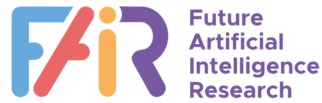
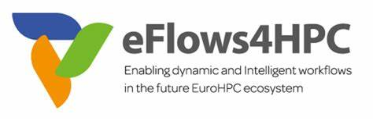
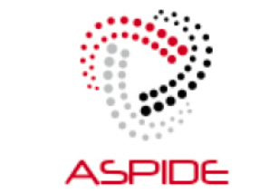

+++
title = "Research"
subtitle = ""

[content]
  # Page type to display. E.g. post, talk, or publication.
  page_type = "post"
  
  
  # Choose how many pages you would like to offset by
  offset = 0

  # Page order. Descending (desc) or ascending (asc) date.
  order = "desc"

  # Filter posts by a taxonomy term.
  [content.filters]
    tag = ""
    category = ""
    publication_type = ""
    exclude_featured = false

[design]
  # Choose how many columns the section has. Valid values: 1 or 2.
  columns = "1"

[background]
  # Background color.
  color = "navy"
  
  # Background gradient.
  gradient_start = "#4bb4e3"
  gradient_end = "#2b94c3"
  
  # Background image.
  image = "background.jpg"  # Name of image in `static/img/`.
  image_darken = 0.6  # Darken the image? Range 0-1 where 0 is transparent and 1 is opaque.

  # Text color (true=light or false=dark).
  text_color_light = true

[image]
placement = 1.0
caption = "Photo by [Academic](https://sourcethemes.com/academic/)"
focal_point = "Center"
preview_only = false

+++

Riccardo Cantini’s research spans two distinct areas: <em>deep learning</em>, focusing on Large Language Models (LLMs) and sustainable artificial intelligence, and <em>big social data analysis</em>, targeting politically polarized data and the efficient execution of data-intensive applications in high-performance distributed environments.

<ul>
    <li><strong><a href="/topics/deep_learning_llm/">Deep Learning and Large Language Models</a></strong></li>
    
Riccardo Cantini’s research in deep learning explores the potential of Transformer-based LLMs, such as BERT and GPT, showcasing their versatility across diverse domains. Sustainability is a central theme in this research area, emphasizing green awareness and promoting the efficient, fair, and trustworthy use of LLMs.

    <li><strong><a href="/topics/big_social_data/">Big Social Data Analysis</a></strong></li>
    
Riccardo Cantini’s research in big social data analysis explores how detailed user information from social media can be leveraged to uncover users’ perceptions of real-world events, offering data-driven insights into socio-political phenomena. His work addresses critical issues including reliability, language barriers, and dynamicity, while also tackling the challenges related to resource-intensive computation.

</ul>

<h3><b>Participation in Research Projects</b></h3>

    

        
    

    

        <h5 class="mb-0 mt-0">
            ECHO-TWIN: Edge-Cloud-HPC Optimized Twins based on Workflow-enhanced Inference Networks
        </h5>
        

            

                <b>Funded by:</b> Italian Ministry of University and Research (MUR), within the National Research, Innovation and Competitiveness Plan 2021–2027 (PN RIC 2021–2027), with the contribution of the European Union, in continuity with NRRP investments supporting research and innovation.
            

            

                <b>Research Objective:</b> Development of AI-driven digital twin systems across the Edge–Cloud–HPC continuum, enabling scalable, energy-efficient, and secure data processing to support research, industry, and public-sector innovation through advanced computing infrastructures and technology transfer.
            

        

    

    

        
    

    

        <h5 class="mb-0 mt-0">
            FAIR: Future Artificial Intelligence Research
        </h5>
        

            

                <b>Funded by:</b> European Union’s NextGenerationEU program, under the Italian National Recovery and Resilience Plan (NRRP).
            

            

                <b>Research Objective:</b> Design and implementation of sustainable AI techniques focusing on interpretable energy estimation and the efficient, fair, and trustworthy use of Large Language Models.
            

        

    

    

        
    

    

        <h5 class="mb-0 mt-0">
            eFlows4HPC: Enabling Dynamic and Intelligent Workflows in the Future EuroHPC Ecosystem
        </h5>
        

            

                <b>Funded by:</b> European High-Performance Computing Joint Undertaking (EuroHPC JU).
            

            

                <b>Research Objective:</b> Use of machine learning techniques for optimizing data partitioning to support efficient execution of data-intensive workflows in HPC environments.
            

        

    

    

        
    

    

        <h5 class="mb-0 mt-0">
            ASPIDE: exAScale ProgramIng models for extreme Data procEssing
        </h5>
        

            

                <b>Funded by:</b> European Union's Horizon 2020 Research and Innovation Programme.
            

            

                <b>Research Objective:</b> Development of in-memory techniques for the efficient execution of data-intensive applications on Exascale architectures.
            

        

    

