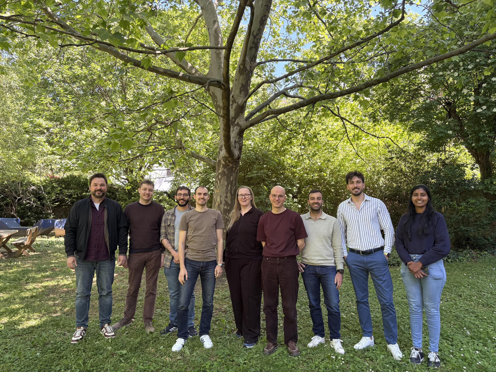
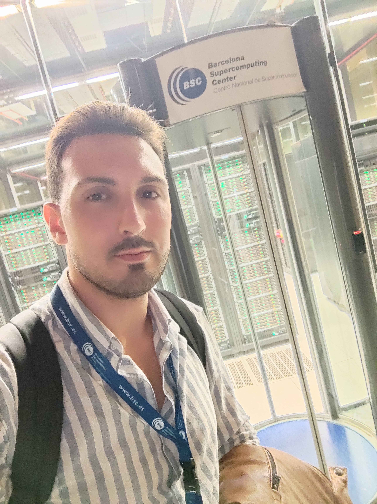
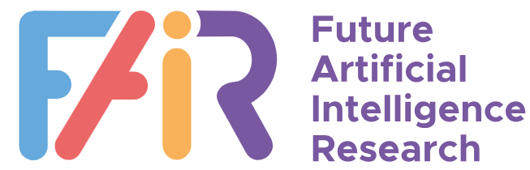
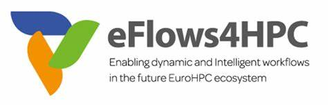
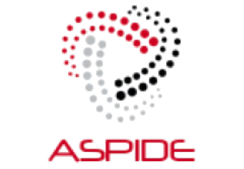

+++
title = "Research"
subtitle = ""

[content]
  # Page type to display. E.g. post, talk, or publication.
  page_type = "post"
  
  
  # Choose how many pages you would like to offset by
  offset = 0

  # Page order. Descending (desc) or ascending (asc) date.
  order = "desc"

  # Filter posts by a taxonomy term.
  [content.filters]
    tag = ""
    category = ""
    publication_type = ""
    exclude_featured = false

[design]
  # Choose how many columns the section has. Valid values: 1 or 2.
  columns = "1"

[background]
  # Background color.
  color = "navy"
  
  # Background gradient.
  gradient_start = "#4bb4e3"
  gradient_end = "#2b94c3"
  
  # Background image.
  image = "background.jpg"  # Name of image in `static/img/`.
  image_darken = 0.6  # Darken the image? Range 0-1 where 0 is transparent and 1 is opaque.

  # Text color (true=light or false=dark).
  text_color_light = true

[image]
placement = 1.0
caption = "Photo by [Academic](https://sourcethemes.com/academic/)"
focal_point = "Center"
preview_only = false

+++

Riccardo Cantini's research spans two interconnected areas: <em>large language models and sustainable AI</em>, with a focus on LLM and agentic systems, their applications, interpretability, fairness, trustworthiness, and efficient deployment in edge-based settings, and <em>big social data analysis</em>, with emphasis on political polarization, data-intensive applications, and efficient processing across distributed and edge-to-cloud environments.

<h3>Large Language Models and Sustainable AI</h3>

<strong>LLM Applications.</strong> Research explores LLM-based methods for extracting knowledge and insights from unstructured data, particularly in social media and healthcare. Contributions include hashtag recommendation, topic modeling, misinformation detection, automated reporting and summarization, public health and disaster monitoring, disease grade prediction, and mental health detection. Recent work investigates agentic conversational systems for natural-language access to structured domain knowledge, including clinical trial information and domain-specific data subject to business rules. A recurring focus is the integration of explainability and interpretability into LLM pipelines to produce reliable and actionable outputs.

<strong>Efficient and Responsible AI.</strong> Research addresses the computational, environmental, and social sustainability of AI. Contributions include knowledge distillation, neural network pruning and quantization, parameter-efficient fine-tuning, and their combination for efficient training and deployment on resource-constrained devices. This line of work also includes green-aware neural architecture search and interpretable energy estimation for edge AI systems. The social dimension encompasses LLM bias and stereotypes, adversarial robustness, and the effects of model scale and reasoning capabilities on fairness and safety. At the intersection of efficiency and responsible AI, research explores the joint optimization of model compression and fairness under resource constraints by designing quantization-aware debiasing techniques with mixed-precision allocation within a fixed memory budget.

<h3>Big Social Data Analysis</h3>

<strong>Political Polarization in Big Social Data.</strong> Research focuses on politically polarized social media data generated during elections and referenda. Contributions include neural and semi-supervised methods for scalable estimation of user polarization; sentiment and emotional-support analysis of political actors; assessment of the effects of bots and temporal dynamics on polarization estimates; and analysis of information diffusion, influence, and competing narrative strategies in polarized networks.

<strong>Big Data Frameworks and ML-Based Optimizations.</strong> Research addresses the efficient execution of data-intensive applications in high-performance distributed environments. Contributions include the investigation of scalable programming paradigms for big data analysis and machine learning-based optimization of parallel and distributed systems, including workflow scheduling and data partitioning strategies for reducing resource consumption and execution time. This systems perspective extends to the edge-to-cloud continuum, applying machine and deep learning to sensor data analysis, smart agriculture anomaly detection, and industrial decision-support systems, connecting scalable data processing with domain-specific applications across industrial and environmental contexts.

<h3><b>Research Internships</b></h3>

    

        
    

    

        <h5 class="mb-0 mt-0">
            Data Management and Knowledge-Driven AI (DMKI) Lab
        </h5>
        

            

                <b>Institution:</b> Databases and Artificial Intelligence (DBAI) Group, Institute of Logic and Computation, Faculty of Informatics, TU Wien, Austria.
            

            

                <b>Period:</b> April 2026 – July 2026
            

            

                <b>Research Title:</b> <em>Uncertainty-Aware Text-to-SQL with Abstention under Domain Knowledge in Agentic LLM Systems</em>
            

            

                <b>Scientific Supervisor:</b> Prof. Dr.-Ing. Katja Hose
            

        

    

    

        
    

    

        <h5 class="mb-0 mt-0">
            Workflows and Distributed Computing Group
        </h5>
        

            

                <b>Institution:</b> Department of Computer Science, Barcelona Supercomputing Center (BSC), Spain.
            

            

                <b>Period:</b> April 2021 – July 2022
            

            

                <b>Research Title:</b> <em>Machine Learning for Optimizing Data-Intensive Workflow Execution in HPC Systems</em>
            

            

                <b>Scientific Supervisor:</b> Prof. Rosa M. Badia
            

        

    

<h3><b>Participation in Research Projects</b></h3>

    

        
    

    

        <h5 class="mb-0 mt-0">
            ECHO-TWIN: Edge-Cloud-HPC Optimized Twins based on Workflow-enhanced Inference Networks
        </h5>
        

            

                <b>Funded by:</b> Italian Ministry of University and Research (MUR), within the National Research, Innovation and Competitiveness Plan 2021–2027 (PN RIC 2021–2027), with the contribution of the European Union, in continuity with NRRP investments supporting research and innovation.
            

            

                <b>Research Objective:</b> Development of AI-driven digital twin systems across the Edge–Cloud–HPC continuum, enabling scalable, energy-efficient, and secure data processing to support research, industry, and public-sector innovation through advanced computing infrastructures and technology transfer.
            

        

    

    

        
    

    

        <h5 class="mb-0 mt-0">
            FAIR: Future Artificial Intelligence Research
        </h5>
        

            

                <b>Funded by:</b> European Union’s NextGenerationEU program, under the Italian National Recovery and Resilience Plan (NRRP).
            

            

                <b>Research Objective:</b> Design and implementation of sustainable AI techniques focusing on interpretable energy estimation and the efficient, fair, and trustworthy use of Large Language Models.
            

        

    

    

        
    

    

        <h5 class="mb-0 mt-0">
            eFlows4HPC: Enabling Dynamic and Intelligent Workflows in the Future EuroHPC Ecosystem
        </h5>
        

            

                <b>Funded by:</b> European High-Performance Computing Joint Undertaking (EuroHPC JU).
            

            

                <b>Research Objective:</b> Use of machine learning techniques for optimizing data partitioning to support efficient execution of data-intensive workflows in HPC environments.
            

        

    

    

        
    

    

        <h5 class="mb-0 mt-0">
            ASPIDE: exAScale ProgramIng models for extreme Data procEssing
        </h5>
        

            

                <b>Funded by:</b> European Union's Horizon 2020 Research and Innovation Programme.
            

            

                <b>Research Objective:</b> Development of in-memory techniques for the efficient execution of data-intensive applications on Exascale architectures.
            

        

    

