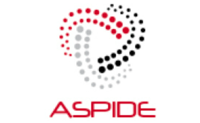

+++
title = "Research"
subtitle = ""

[content]
  # Page type to display. E.g. post, talk, or publication.
  page_type = "post"
  
  
  # Choose how many pages you would like to offset by
  offset = 0

  # Page order. Descending (desc) or ascending (asc) date.
  order = "desc"

  # Filter posts by a taxonomy term.
  [content.filters]
    tag = ""
    category = ""
    publication_type = ""
    exclude_featured = false

[design]
  # Choose how many columns the section has. Valid values: 1 or 2.
  columns = "1"

[background]
  # Background color.
  color = "navy"
  
  # Background gradient.
  gradient_start = "#4bb4e3"
  gradient_end = "#2b94c3"
  
  # Background image.
  image = "background.jpg"  # Name of image in `static/img/`.
  image_darken = 0.6  # Darken the image? Range 0-1 where 0 is transparent and 1 is opaque.

  # Text color (true=light or false=dark).
  text_color_light = true

[image]
placement = 1.0
caption = "Photo by [Academic](https://sourcethemes.com/academic/)"
focal_point = "Center"
preview_only = false

+++

Riccardo Cantini’s research spans two distinct areas: <em>deep learning</em>, focusing on large language models (LLMs) and sustainable artificial intelligence, and <em>big social data analysis</em>, targeting politically polarized data and the efficient execution of data-intensive applications in high-performance distributed environments.

<ul>
    <li><strong><a href="/topics/deep_learning_llm/">Deep Learning and Large Language Models</a></strong></li>
    
Riccardo Cantini’s research in deep learning explores the potential of Transformer-based large language models (LLMs), such as BERT and GPT, showcasing their versatility across diverse domains. Sustainability is a central theme in this research area, emphasizing green awareness and promoting the efficient, fair, and trustworthy use of LLMs.

    <li><strong><a href="/topics/big_social_data/">Big Social Data Analysis</a></strong></li>
    
Riccardo Cantini’s research in big social data analysis explores how detailed user information from social media can be leveraged to uncover users’ perceptions of real-world events, offering data-driven insights into socio-political phenomena. His work addresses critical issues including reliability, language barriers, and dynamicity, while also tackling the challenges related to resource-intensive computation.

</ul>

<h3><b>Participation in Research Projects</b></h3>

	

		
	

	

		<h5 class="mb-0 mt-0"><a href="https://fondazione-fair.it/" target="_blank">
FAIR: Future Artificial Intelligence Research</a></h5>
		

			

				Funded by the European Union's NextGenerationEU program
			

		

	

	

		
	

	

		<h5 class="mb-0 mt-0"><a href="https://eflows4hpc.eu/" target="_blank">
eFlows4HPC: enabling dynamic and Intelligent workflows in the future EuroHPC ecosystem</a></h5>
		

			

				Funded by the European High-Performance Computing Joint Undertaking
			

		

	

	

		
	

	

		<h5 class="mb-0 mt-0"><a href="https://cordis.europa.eu/project/id/801091" target="_blank">
ASPIDE: exAScale ProgramIng models for extreme Data procEssing</a></h5>
		

			

				Funded by the European Union’s Horizon 2020 Research and Innovation Program
			

		

	

